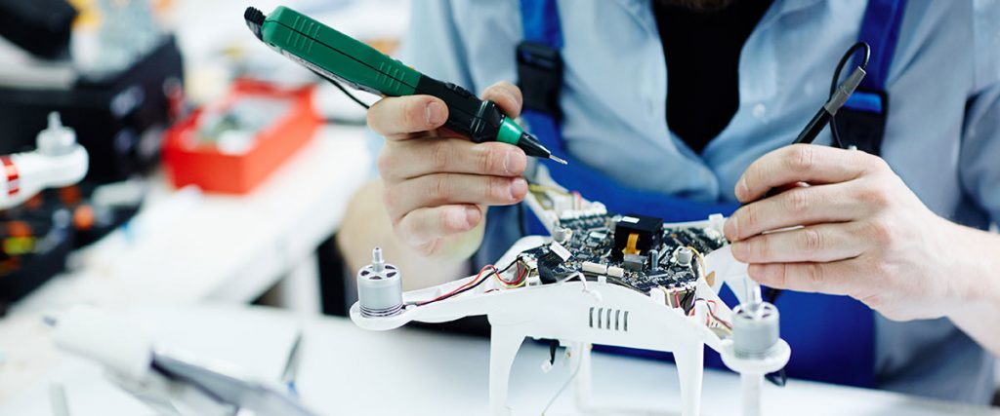

# INTRODUCCIÓN A LA MECATRÓNICA
<!-- Portada de Portafolio Karen Pastrana -->

  <h1 style="color:#4b0082;">Introducción a la Mecatrónica</h1>
  
Bienvenido(a) a mi portafolio.

  
  <!-- Imagen de portada -->
  

  

  <!-- Trabajos Semanales -->
  <h2 style="color:#ff4500;">Trabajos Semanales</h2>
  

    <!-- Semana 1 -->
    

      <h2 style="color:#228b22;">Semana 1</h2>
      <a href="https://karenpastrana.github.io/PORTAFOLIO/INTRODUCCIÓN_A_LA_MECATRÓNICA/ACTIVIDADES/SEMANA1/" 
         style="display:block; background-image:url('../../assets/imgs/FW1.jpg'); background-size:cover; background-position:center; color:white; text-decoration:none; padding:50px 0; border-radius:15px; font-weight:bold; font-size:18px; margin:10px;">
         Semana 1
      </a>
    

    <!-- Semana 2 -->
    

      <h2 style="color:#228b22;">Semana 2</h2>
      <a href="https://karenpastrana.github.io/PORTAFOLIO/INTRODUCCIÓN_A_LA_MECATRÓNICA/ACTIVIDADES/SEMANA2/" 
         style="display:block; background-image:url('../../assets/imgs/FW2.jpg'); background-size:cover; background-position:center; color:white; text-decoration:none; padding:50px 0; border-radius:15px; font-weight:bold; font-size:18px; margin:10px;">
         Semana 2
      </a>
    

    <!-- Semana 3 -->
    

      <h2 style="color:#228b22;">Semana 3</h2>
      <a href="https://karenpastrana.github.io/PORTAFOLIO/INTRODUCCIÓN_A_LA_MECATRÓNICA/ACTIVIDADES/SEMANA3/" 
         style="display:block; background-image:url('../../assets/imgs/FW3.jpeg'); background-size:cover; background-position:center; color:white; text-decoration:none; padding:50px 0; border-radius:15px; font-weight:bold; font-size:18px; margin:10px;">
         Semana 3
      </a>
    

    <!-- Semana 4 -->
    

      <h2 style="color:#228b22;">Semana 4</h2>
      <a href="https://karenpastrana.github.io/PORTAFOLIO/INTRODUCCIÓN_A_LA_MECATRÓNICA/ACTIVIDADES/SEMANA4/" 
         style="display:block; background-image:url('../../assets/imgs/FW4.png'); background-size:cover; background-position:center; color:white; text-decoration:none; padding:50px 0; border-radius:15px; font-weight:bold; font-size:18px; margin:10px;">
         Semana 4
      </a>
    

    <!-- Semana 5 -->
    

      <h2 style="color:#228b22;">Semana 5</h2>
      <a href="https://karenpastrana.github.io/PORTAFOLIO/INTRODUCCIÓN_A_LA_MECATRÓNICA/ACTIVIDADES/SEMANA5/" 
         style="display:block; background-image:url('../../assets/imgs/FW5.png'); background-size:cover; background-position:center; color:white; text-decoration:none; padding:50px 0; border-radius:15px; font-weight:bold; font-size:18px; margin:10px;">
         Semana 5
      </a>
    

    <!-- Semana 6 -->
    

      <h2 style="color:#228b22;">Semana 6</h2>
      <a href="https://karenpastrana.github.io/PORTAFOLIO/INTRODUCCIÓN_A_LA_MECATRÓNICA/ACTIVIDADES/SEMANA6/" 
         style="display:block; background-image:url('../../assets/imgs/FW6.png'); background-size:cover; background-position:center; color:white; text-decoration:none; padding:50px 0; border-radius:15px; font-weight:bold; font-size:18px; margin:10px;">
         Semana 6
      </a>
    

    <!-- Semana 7 -->
    

      <h2 style="color:#228b22;">Semana 7</h2>
      <a href="https://karenpastrana.github.io/PORTAFOLIO/INTRODUCCIÓN_A_LA_MECATRÓNICA/ACTIVIDADES/SEMANA7/" 
         style="display:block; background-image:url('../../assets/imgs/FW7.jpg'); background-size:cover; background-position:center; color:white; text-decoration:none; padding:50px 0; border-radius:15px; font-weight:bold; font-size:18px; margin:10px;">
         Semana 7
      </a>
    

    <!-- Semana 8 -->
    

      <h2 style="color:#228b22;">Semana 8</h2>
      <a href="https://karenpastrana.github.io/PORTAFOLIO/INTRODUCCIÓN_A_LA_MECATRÓNICA/ACTIVIDADES/SEMANA8/" 
         style="display:block; background-image:url('../../assets/imgs/FW8.jpg'); background-size:cover; background-position:center; color:white; text-decoration:none; padding:50px 0; border-radius:15px; font-weight:bold; font-size:18px; margin:10px;">
         Semana 8
      </a>
    

  

  

  <!-- Proyecto Final -->
  

  <h2 style="color:#228b22;">Proyecto Final</h2>
  <a href="https://karenpastrana.github.io/PORTAFOLIO/INTRODUCCIÓN_A_LA_MECATRÓNICA/PROYECTO/" style="display:inline-block; background-image:url('../../assets/imgs/proyecto-bg.png'); background-size:cover; background-position:center; color:white; text-decoration:none; padding:50px 60px; border-radius:15px; font-weight:bold; font-size:18px; margin:10px;">Proyecto Final</a>

  

  <!-- About -->
  

  <h2 style="color:#1e90ff;">About</h2>
  <a href="https://karenpastrana.github.io/PORTAFOLIO/INTRODUCCIÓN_A_LA_MECATRÓNICA/2_ABOUT/" style="display:inline-block; background-image:url('../../assets/imgs/about-bg.png'); background-size:cover; background-position:center; color:white; text-decoration:none; padding:50px 60px; border-radius:15px; font-weight:bold; font-size:18px; margin:10px;">Sobre mí</a>

  

