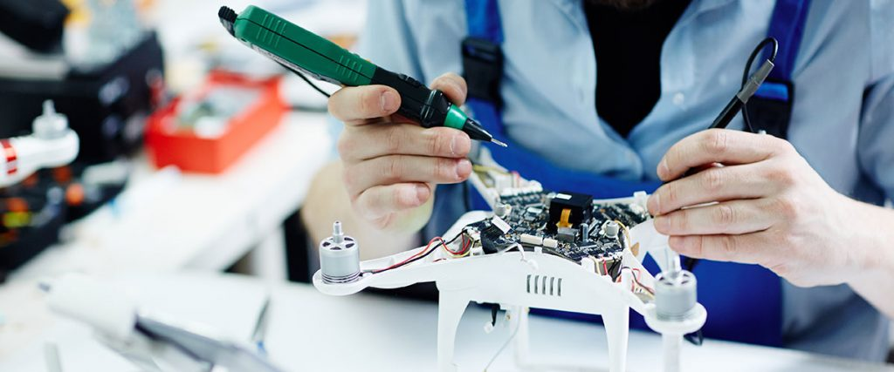

# INICIO
<!-- Portada de Portafolio Karen Pastrana -->

  <h1 style="color:#4b0082;">Introducción a la Mecatrónica</h1>
  
Bienvenido(a).

  
  <!-- Imagen de portada -->
  

  

  <!-- Trabajos Semanales -->
  <h2 style="color:#ff4500;">Trabajos Semanales</h2>
  

    <!-- Actividad 1: Página web -->
    

      <h2 style="color:#228b22;">Actividad 1</h2>
      <a href="https://karenpastrana.github.io/PORTAFOLIO/INTRODUCCIÓN_A_LA_MECATRÓNICA/ACTIVIDADES/SEMANA1/" 
         style="display:block; background-image:url('../assets/imgs/FW1.jpg'); background-size:cover; background-position:center; color:white; text-decoration:none; padding:50px 0; border-radius:15px; font-weight:bold; font-size:18px; margin:10px;">
         Actividad 1
      </a>
    

    <!-- Actividad 2: Circuito con osciloscopio -->
    

      <h2 style="color:#228b22;">Actividad 2</h2>
      <a href="https://karenpastrana.github.io/PORTAFOLIO/INTRODUCCIÓN_A_LA_MECATRÓNICA/ACTIVIDADES/SEMANA2/" 
         style="display:block; background-image:url('../assets/imgs/FW2.jpg'); background-size:cover; background-position:center; color:white; text-decoration:none; padding:50px 0; border-radius:15px; font-weight:bold; font-size:18px; margin:10px;">
         Actividad 2
      </a>
    

    <!-- Actividad 3: LED -->
    

      <h2 style="color:#228b22;">Actividad 3</h2>
      <a href="https://karenpastrana.github.io/PORTAFOLIO/INTRODUCCIÓN_A_LA_MECATRÓNICA/ACTIVIDADES/SEMANA3/" 
         style="display:block; background-image:url('../assets/imgs/FW3.jpeg'); background-size:cover; background-position:center; color:white; text-decoration:none; padding:50px 0; border-radius:15px; font-weight:bold; font-size:18px; margin:10px;">
         Actividad 3
      </a>
    

    <!-- Actividad 4: LED con botón -->
    

      <h2 style="color:#228b22;">Actividad 4</h2>
      <a href="https://karenpastrana.github.io/PORTAFOLIO/INTRODUCCIÓN_A_LA_MECATRÓNICA/ACTIVIDADES/SEMANA4/" 
         style="display:block; background-image:url('../assets/imgs/FW4.png'); background-size:cover; background-position:center; color:white; text-decoration:none; padding:50px 0; border-radius:15px; font-weight:bold; font-size:18px; margin:10px;">
         Actividad 4
      </a>
    

    <!-- Actividad 5: Conexión Bluetooth -->
    

      <h2 style="color:#228b22;">Actividad 5</h2>
      <a href="https://karenpastrana.github.io/PORTAFOLIO/INTRODUCCIÓN_A_LA_MECATRÓNICA/ACTIVIDADES/SEMANA5/" 
         style="display:block; background-image:url('../assets/imgs/FW5.png'); background-size:cover; background-position:center; color:white; text-decoration:none; padding:50px 0; border-radius:15px; font-weight:bold; font-size:18px; margin:10px;">
         Actividad 5
      </a>
    

    <!-- Actividad 6: Motor -->
    

      <h2 style="color:#228b22;">Actividad 6</h2>
      <a href="https://karenpastrana.github.io/PORTAFOLIO/INTRODUCCIÓN_A_LA_MECATRÓNICA/ACTIVIDADES/SEMANA6/" 
         style="display:block; background-image:url('../assets/imgs/FW6.png'); background-size:cover; background-position:center; color:white; text-decoration:none; padding:50px 0; border-radius:15px; font-weight:bold; font-size:18px; margin:10px;">
         Actividad 6
      </a>
    

    <!-- Actividad 7: Servo -->
    

      <h2 style="color:#228b22;">Actividad 7</h2>
      <a href="https://karenpastrana.github.io/PORTAFOLIO/INTRODUCCIÓN_A_LA_MECATRÓNICA/ACTIVIDADES/SEMANA7/" 
         style="display:block; background-image:url('../assets/imgs/FW7.jpg'); background-size:cover; background-position:center; color:white; text-decoration:none; padding:50px 0; border-radius:15px; font-weight:bold; font-size:18px; margin:10px;">
         Actividad 7
      </a>
    

    <!-- Actividad 8 -->
    

      <h2 style="color:#228b22;">Actividad 8</h2>
      <a href="https://karenpastrana.github.io/PORTAFOLIO/INTRODUCCI%C3%93N_A_LA_MECATR%C3%93NICA/ACTIVIDADES/SEMANA8/" 
         style="display:block; background-image:url('../assets/imgs/FW8.jpg'); background-size:cover; background-position:center; color:white; text-decoration:none; padding:50px 0; border-radius:15px; font-weight:bold; font-size:18px; margin:10px;">
         Actividad 8
      </a>
    

     <!-- Actividad 9 -->
    

      <h2 style="color:#228b22;">Actividad 9</h2>
      <a href="https://karenpastrana.github.io/PORTAFOLIO/INTRODUCCI%C3%93N_A_LA_MECATR%C3%93NICA/ACTIVIDADES/SEMANA9/" 
         style="display:block; background-image:url('../assets/imgs/FW9.jpg'); background-size:cover; background-position:center; color:white; text-decoration:none; padding:50px 0; border-radius:15px; font-weight:bold; font-size:18px; margin:10px;">
         Actividad 9
      </a>
    

     <!-- Actividad 10 -->
    

      <h2 style="color:#228b22;">Actividad 10</h2>
      <a href="https://karenpastrana.github.io/PORTAFOLIO/INTRODUCCI%C3%93N_A_LA_MECATR%C3%93NICA/ACTIVIDADES/SEMANAS10/" 
         style="display:block; background-image:url('../assets/imgs/FW10.jpg'); background-size:cover; background-position:center; color:white; text-decoration:none; padding:50px 0; border-radius:15px; font-weight:bold; font-size:18px; margin:10px;">
         Actividad 10
      </a>
    

     <!-- Actividad 11 -->
    

      <h2 style="color:#228b22;">Actividad 11</h2>
      <a href="https://karenpastrana.github.io/PORTAFOLIO/INTRODUCCI%C3%93N_A_LA_MECATR%C3%93NICA/ACTIVIDADES/SEMANAS11/" 
         style="display:block; background-image:url('../assets/imgs/FW11.jpg'); background-size:cover; background-position:center; color:white; text-decoration:none; padding:50px 0; border-radius:15px; font-weight:bold; font-size:18px; margin:10px;">
         Actividad 11
      </a>
    

  

  

  <!-- Proyectos Finales -->
  

  <h2 style="color:#228b22;">Proyecto 1 Carro Robot 1</h2>
  <a href="https://karenpastrana.github.io/PORTAFOLIO/INTRODUCCIÓN_A_LA_MECATRÓNICA/PROYECTO/" style="display:inline-block; background-image:url('../assets/imgs/proyecto-bg.png'); background-size:cover; background-position:center; color:white; text-decoration:none; padding:50px 60px; border-radius:15px; font-weight:bold; font-size:18px; margin:10px;">Proyecto Final</a>

<h2 style="color:#228b22;">Proyecto 2 Plataforma 2</h2>
  <a href="https://karenpastrana.github.io/PORTAFOLIO/INTRODUCCIÓN_A_LA_MECATRÓNICA/PROYECTO2/" style="display:inline-block; background-image:url('../assets/imgs/proyecto-bg.png'); background-size:cover; background-position:center; color:white; text-decoration:none; padding:50px 60px; border-radius:15px; font-weight:bold; font-size:18px; margin:10px;">Proyecto Final 2</a>

  

  <!-- About -->
  

  <h2 style="color:#1e90ff;">About</h2>
  <a href="https://karenpastrana.github.io/PORTAFOLIO/INTRODUCCIÓN_A_LA_MECATRÓNICA/2_ABOUT/" style="display:inline-block; background-image:url('../assets/imgs/about-bg.png'); background-size:cover; background-position:center; color:white; text-decoration:none; padding:50px 60px; border-radius:15px; font-weight:bold; font-size:18px; margin:10px;">Sobre mí</a>

  

