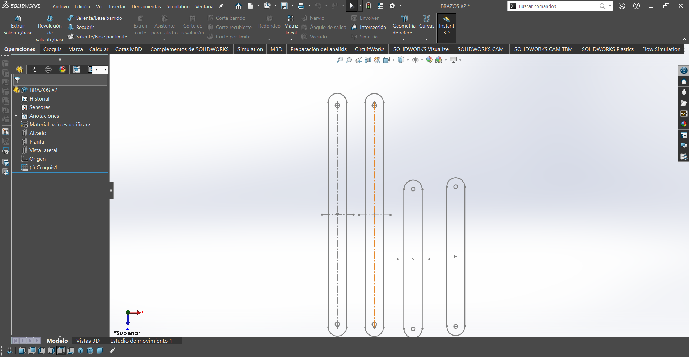

# Proyecto 2: Plataforma con 2 Servos para Balancear Pelota 

Este proyecto combina la **Visión por Computadora (OpenCV)** con el control del **ESP32** para crear una plataforma que rastrea y equilibra una pelota de color verde en tiempo real. La cámara identifica la pelota, calcula su posición y envía órdenes a dos servomotores para mantenerla siempre en el centro.

## **Fase 1: Visión y Detección (Python)**
Se localizó la pelota con precisión en el video.

1. **Configuración de la Cámara:** Capturamos el video en vivo y aplicamos un filtro de desenfoque para eliminar el ruido visual.
2. **Detección de Color (Máscara):** Convertimos la imagen a HSV y definimos el rango de color verde (`greenLower` / `greenUpper`) para crear una máscara binaria (donde la pelota es blanca y todo lo demás es negro).
3. **Localización Precisa:** Usamos los contornos y el centroide para encontrar el punto central exacto de la pelota en la pantalla.

## **Fase 2: Diseño Físico**
Elegimos usar dos servomotores MG995 para controlar los movimientos horizontal (X) y vertical (Y), para mover la plataforma con más torque, suficiente velocidad y estabilidad. Usamos esta imagen de referencia para el diseño de la plataforma y la colocación de los servomotores.

<div align="center">

</div>
   
La estructura de la plataforma se construyó combinando corte láser e impresión 3D. La base, la superficie y los soportes que sostienen la plataforma fueron cortadas en MDF. Estos últimos se diseñaron pra que formaran una especie de "L" para que de este modo la plataforma tuviera un mayor movimiento.

Por otro lado, el soporte central que permite girar la plataforma, los soportes de los servos y el de los brazos fueron impresos en 3D. 

### **Piezas MDF**

#### Soportes de plataforma
<div align="center">

</div>
   
<div align="center">
  <a href="../assets/Archivos/BRAZOS_X2.SLDPRT" download>
    
  </a>
</div>

#### Base y superficie (45 x 45)
<div align="center">

</div>
   
<div align="center">
  <a href="../assets/Archivos/BASE.DXF" download>
    
  </a>
</div>

### **Piezas impresión 3D**

#### Pieza 1 Soporte central

<div align="center">

</div>
   
<div align="center">
  <a href="../assets/Archivos/CENTRO.SLDPRT" download>
    
  </a>
</div>

#### Pieza 2 Soporte central

<div align="center">

</div>
   
<div align="center">
  <a href="../assets/Archivos/CENTRAL.SLDPRT" download>
    
  </a>
</div>

#### Pieza Soporte central

<div align="center">

</div>

<div align="center">
<a href="../assets/Archivos/SOPORTE_CENTRAL.SLDASM" download>

 </a>
</div>
      
<div align="center">
<a href="../assets/Archivos/SOPORTE_CENTRAL.SLDPRT" download>
   
  </a>
</div>

#### Soportes de servos

<div align="center">

</div>
   
<div align="center">
<a href="../assets/Archivos/BASE_SERVOS_X2.SLDPRT" download>

</a>
</div>

#### Soportes de brazos

<div align="center">

</div>
   
<div align="center">
  <a href="../assets/Archivos/SOPORTE_BRAZOS_X2.SLDPRT" download>
    
  </a>
</div>


## **Fase 3: Fase de Control (PID) y Calibración**

Esta fase fue importante para que la pelota se mantuviera balanceada. Con ayuda del **PID** se calculó la corrección necesaria para llevar la pelota al centro y mantenerla ahí.

### Implementación del PID (Python)
1. **Cálculo de Error:** Comparamos dónde está la pelota (`center`) con dónde debería estar (`target = 300`).
2. **Fórmula PID:**
    - **Proporcional (P):** Qué tan lejos está la pelota ahora. (Corrección inmediata).
    - **Integral (I):** Acumula el error a lo largo del tiempo. Corrige pequeños errores constantes, como la fricción.
    - **Derivativo (D):** Velocidad con la que se mueve la pelota. Ayuda a frenar el sistema y a evitar que oscile.
3. **Conversión a Ángulo:** El resultado de la fórmula PID se transforma directamente en los ángulos finales que deben tomar los servos.

### Calibración y ajustes
- **Ventana de Sliders:** Creamos una ventana de ajustes (`Ajustes PID`) que permite cambiar los coeficientes **Kp**, **Ki** y **Kd** en tiempo real para sintonizar el sistema hasta lograr la estabilidad.

``` codigo
!!! "Nota: Valores utilizados"
   - Kp: 8
   - Ki: 0
   - Kd: 100
```

- **Límites:** Se establecieron límites de ángulo tanto en Python como en el ESP32 para proteger los motores de movimientos bruscos.

### Control manual
Para asegurar que los servos reaccionen lo más rápido posible, se controlaron de forma directa.

1. **Control Directo:** Generamos la señal de control (PWM) manualmente usando la función `moverServo` y `delayMicroseconds`.
2. El ESP32 llama continuamente a `moverServo` para que los motores mantengan su posición y estén listos para reaccionar de inmediato a la siguiente orden del programa.


### Videos de pruebas

<div align="center">
<video width="325" controls muted>
  <source src="../assets/Videos/C1.mp4" type="video/mp4">
</video>

<video width="325" controls muted>
  <source src="../assets/Videos/C2.mp4" type="video/mp4">
</video>

<video width="325" controls muted>
  <source src="../assets/Videos/C3.mp4" type="video/mp4">
</video>
</div>


## Códigos finales

### Código Python

```python
import cv2
import numpy as np
import serial
import time
 
# --- CONFIGURACIÓN ---
COM_PORT = 'COM7'  # <--- puerto
BAUD_RATE = 115200
 
# CONSTANTES INICIALES
FLAT_AZUL = 90
FLAT_VERDE = 110
 
# Rango de color VERDE
greenLower = (40, 70, 50)
greenUpper = (85, 255, 255)
 
# --- CONEXIÓN SERIAL ---
try:
    ser = serial.Serial(COM_PORT, BAUD_RATE, timeout=1)
    print(f"Conectado a {COM_PORT}")
    time.sleep(1)
except:
    print("ERROR: No se pudo conectar al Bluetooth.")
    exit()
 
# Buscar cámara 
cap = cv2.VideoCapture(1, cv2.CAP_DSHOW)
if not cap.isOpened():
    cap = cv2.VideoCapture(0, cv2.CAP_DSHOW)
 
# --- VENTANA DE AJUSTES (SLIDERS) ---
def nothing(x): pass
 
cv2.namedWindow("Ajustes PID")
cv2.resizeWindow("Ajustes PID", 400, 200)
 
# Sliders.
# Formato: ("Nombre", "Ventana", ValorInicial, ValorMaximo, Funcion)
# NOTA: Los sliders solo manejan enteros. Dividiremos en el código.
cv2.createTrackbar("Kp x100", "Ajustes PID", 35, 200, nothing)  # 35 -> 0.35
cv2.createTrackbar("Ki x1000", "Ajustes PID", 0, 100, nothing)  # 0 -> 0.000
cv2.createTrackbar("Kd x100", "Ajustes PID", 15, 200, nothing)  # 15 -> 0.15
 
# Variables PID
prev_error_x = 0; prev_error_y = 0
integral_x = 0; integral_y = 0
 
print("--- SISTEMA INICIADO ---")
print("Usa la ventana 'Ajustes PID' para calibrar.")
print("Presiona 'q' para salir.")
 
while True:
    ret, frame = cap.read()
    if not ret: break
 
    frame = cv2.resize(frame, (600, 600))
    blurred = cv2.GaussianBlur(frame, (11, 11), 0)
    hsv = cv2.cvtColor(blurred, cv2.COLOR_BGR2HSV)
 
    mask = cv2.inRange(hsv, greenLower, greenUpper)
    mask = cv2.erode(mask, None, iterations=2)
    mask = cv2.dilate(mask, None, iterations=2)
 
    cnts, _ = cv2.findContours(mask.copy(), cv2.RETR_EXTERNAL, cv2.CHAIN_APPROX_SIMPLE)
   
    # --- LEER VALORES DE LOS SLIDERS ---
    # Leemos el valor entero y lo convertimos a decimal
    val_p = cv2.getTrackbarPos("Kp x100", "Ajustes PID")
    val_i = cv2.getTrackbarPos("Ki x1000", "Ajustes PID")
    val_d = cv2.getTrackbarPos("Kd x100", "Ajustes PID")
 
    Kp = val_p / 100.0      # Ej: 35 / 100 = 0.35
    Ki = val_i / 1000.0     # Ej: 5 / 1000 = 0.005
    Kd = val_d / 100.0      # Ej: 15 / 100 = 0.15
 
    # Dibujar valores en pantalla para referencia
    cv2.putText(frame, f"P: {Kp:.2f}  I: {Ki:.3f}  D: {Kd:.2f}", (10, 30),
                cv2.FONT_HERSHEY_SIMPLEX, 0.7, (255, 0, 255), 2)
 
    center = None
    servo_azul = FLAT_AZUL
    servo_verde = FLAT_VERDE
 
    if len(cnts) > 0:
        c = max(cnts, key=cv2.contourArea)
        ((x, y), radius) = cv2.minEnclosingCircle(c)
        M = cv2.moments(c)
       
        if M["m00"] > 0:
            center = (int(M["m10"] / M["m00"]), int(M["m01"] / M["m00"]))
           
            # Visuales
            cv2.circle(frame, (int(x), int(y)), int(radius), (0, 255, 255), 2)
            #cv2.line(frame, center, (300, 300), (255, 0, 0), 2)
 
            # --- PID ---
            target = 300
            error_x = target - center[0]
            error_y = target - center[1]
 
            # PID X
            integral_x += error_x
            derivative_x = error_x - prev_error_x
            output_x = (Kp * error_x) + (Ki * integral_x) + (Kd * derivative_x)
            prev_error_x = error_x
 
            # PID Y
            integral_y += error_y
            derivative_y = error_y - prev_error_y
            output_y = (Kp * error_y) + (Ki * integral_y) + (Kd * derivative_y)
            prev_error_y = error_y
 
            # --- MAPEO ---
            servo_verde = int(FLAT_VERDE - output_x)
            servo_azul = int(FLAT_AZUL - output_y)
 
    else:
        # Si se pierde la bola, resetear integrales para evitar "golpes" al volver
        integral_x = 0
        integral_y = 0
        cv2.putText(frame, "CENTERING", (10, 60), cv2.FONT_HERSHEY_SIMPLEX, 1, (0, 0, 255), 2)
 
    # Limites físicos
    servo_azul = max(60, min(120, servo_azul))
    servo_verde = max(80, min(140, servo_verde))
 
    # Enviar al ESP32
    try:
        comando = f"{servo_azul},{servo_verde}\n"
        ser.write(comando.encode('utf-8'))
    except:
        pass
 
    cv2.imshow("Robot Vision", frame)
   
    if cv2.waitKey(1) & 0xFF == ord('q'):
        break
 
cap.release()
cv2.destroyAllWindows()
ser.close()
```

### Código Arduino

```cpp
#include <Arduino.h>
#include "BluetoothSerial.h"
 
BluetoothSerial SerialBT;
 
// --- PINES ---
const int PIN_AZUL = 27;  // Servo Y
const int PIN_VERDE = 14; // Servo X
 
// --- VARIABLES ---
int anguloAzul = 90;   // Inicia en Plano
int anguloVerde = 110; // Inicia en Plano
 
// --- FUNCIÓN MANUAL (Bit-Banging) ---
// Genera la señal PWM directamente sin la librería Servo.h
void moverServo(int pin, int angulo) {
  // Limites duros de seguridad
  if (angulo < 40) angulo = 40;
  if (angulo > 150) angulo = 150;
 
  // Matematica: 0deg=500us, 180deg=2400us
  // Convierte el ángulo al ancho de pulso en microsegundos (500us a 2400us)
  int pulso = 500 + ((long)angulo * 1900) / 180;

  // Generación del pulso
  digitalWrite(pin, HIGH);
  delayMicroseconds(pulso);
  digitalWrite(pin, LOW);
}
 
void setup() {
  Serial.begin(115200);
 
  // NOMBRE DEL BLUETOOTH
  SerialBT.begin("ESP32_BALL_PLATE");
  Serial.println("BLUETOOTH LISTO: Conecta a 'ESP32_BALL_PLATE'");
 
  pinMode(PIN_AZUL, OUTPUT);
  pinMode(PIN_VERDE, OUTPUT);
}
 
void loop() {
  // 1. RECEPCIÓN DE DATOS
  if (SerialBT.available()) {
    // Leer hasta el salto de línea que envía Python
    String paquete = SerialBT.readStringUntil('\n');
    paquete.trim(); // Quitamos espacios basura
 
    // Buscar la coma separadora "anguloY,anguloX" ("90,110")
    int coma = paquete.indexOf(',');
    if (coma > 0) {
      String sAzul = paquete.substring(0, coma);
      String sVerde = paquete.substring(coma + 1);
 
      // Convertir a entero
      anguloAzul = sAzul.toInt();
      anguloVerde = sVerde.toInt();
    }
  }
 
  // 2. REFRESCO CONSTANTE (Vital para que no se 'suelten' los servos)
  // Se llama la función continuamente para mantener la señal PWM de los servos
  moverServo(PIN_AZUL, anguloAzul);
  moverServo(PIN_VERDE, anguloVerde);
 
  // Pausa para completar ciclo
  delay(15);
}
```

## Resultados y Conclusión
**Videos**

<div align="center">
<video width="325" controls muted>
  <source src="../assets/Videos/C4.mp4" type="video/mp4">
</video>

<video width="325" controls muted>
  <source src="../assets/Videos/CF.mp4" type="video/mp4">
</video>
</div>

Con este proyecto logramos elaborar una plataforma funcional que balanceara una pelota, integrando conocimientos de programación, mecánica y electrónica. Con Python se aprendió a usar la cámara para detectar la pelota verde y encontrar su posición exacta. También, con la ayuda del PID, la plataforma fue capaz de frenar y acelerar lo necesario para que la pelota regresara al centro de forma suave y precisa.

Además, al controlar los motores directamente, se evitó que hubiera errores de conexión y que la plataforma ejecutara el movimiento con la velocidad y precisión adecuada. La calibración fue lo que hizo que la plataforma funcionara de manera suave, sin movimientos bruscos y oscilaciones, ya que todo fue un proceso de prueba y error. Esto nos llevó a realizar varios cambios y ajustes que nos ayudaron a entender cómo un sistema puede ver, pensar y reaccionar al entorno.
