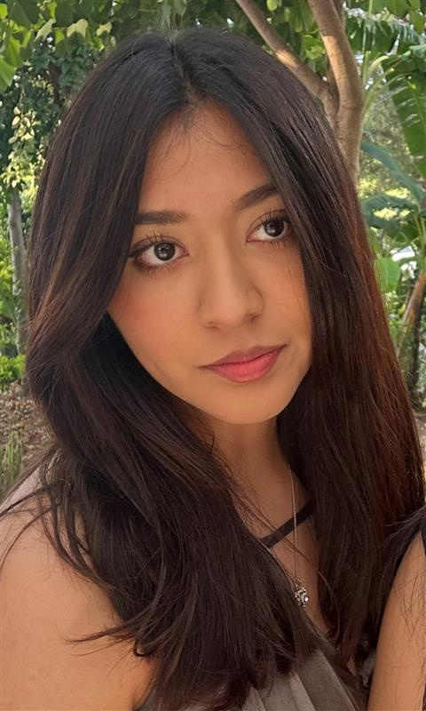

# Sobre nosotras

## ¿Quiénes somos?

### KAREN

  
  

    Hola, soy Karen Melissa Pastrana Monzón, estudiante de Ingeniería Mecatrónica en la IBERO Puebla, México. Tengo 18 años y estoy en primer semestre. Estudio Ingeniería Mecatrónica porque me gusta la idea de poder desaarrollar mis habilidaades y conocimientos para poder innovar y crear soluciones. Me considero una persona muy activa; practico taekwondo desde los 7 años, hace casi dos años comencé a ir a natación, hace un año me metí al gimnasio y hace un mes comencé con pilates. Además, me gusta mucho bailar, desde coreográfico hasta ritmos latinos. Otros de mis hobbies son pasar tiempo con mi familia y mascotas, escuchar música, entre otras cosas.
  

 

 

 Uno de los proyectos que he realizado es el prototipo de un wereable, el cual realicé para el "Concurso Vanguardia Tecnológica Ada Byron"; este wearable tiene como objetivo hacer mediciones médicas (temperatura, oxigenación, frecuencia cradiaca y humedad de la piel) para guardar los datos y compararlos con aquellos que son de una persona saludable y en caso de ser anormales mandaba una alerta al usuario; además, los datos registrados los podría verificar un médico mediante una aplicación para realizar un mejor diagnóstico.
  

**Información de contacto:**
195949@iberopuebla.mx

---

### SAM

  
  

    Mis hobbies son dibujar, tocar la guitarra y jugar videojuegos.
  

  Mi mayor logro es...

---

