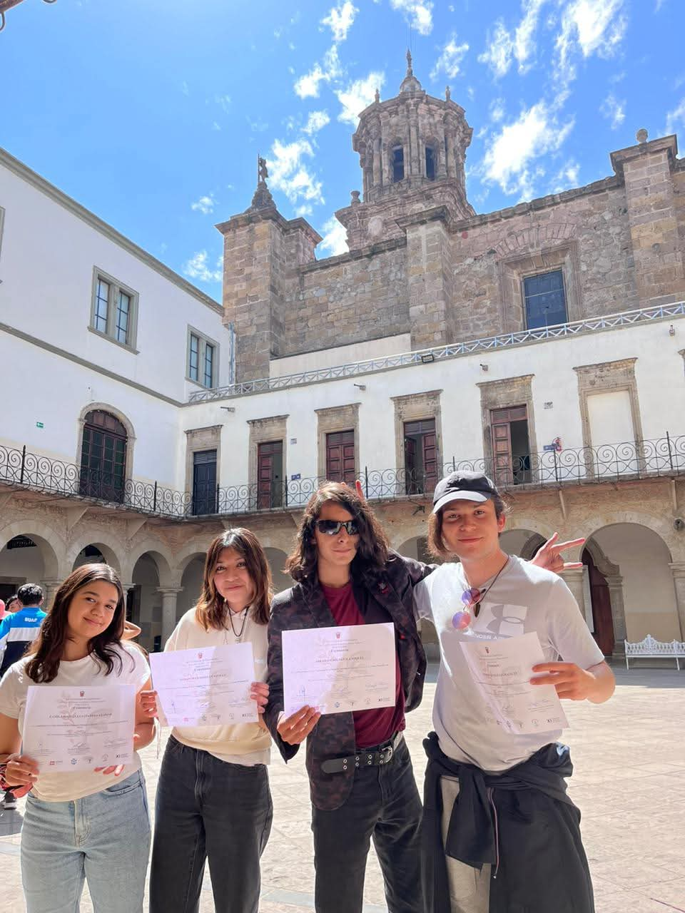
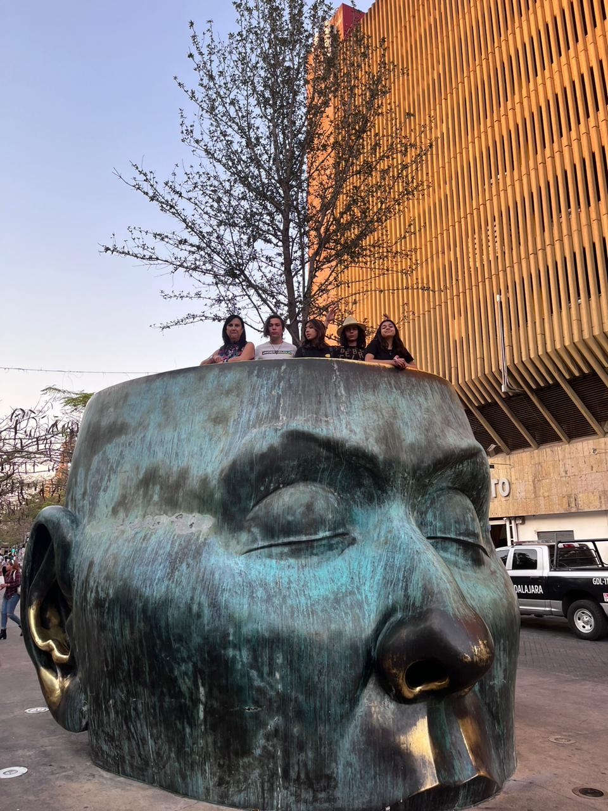

# ABOUT

## ¿Quiénes somos?

### KAREN

  
  

    Hola, soy Karen Melissa Pastrana Monzón, estudiante de Ingeniería Mecatrónica en la IBERO Puebla. Tengo 18 años y estoy en primer semestre. Estudio Ingeniería Mecatrónica porque me gusta la idea de poder desarrollar mis habilidades y conocimientos para innovar y crear soluciones.
   

De hecho, algo interesante sobre mí es que antes de escoger Ingeniería Mecatrónica tenía otras opciones que eran un tanto diferentes. Comencé queriendo estudiar para piloto aviador militar; sin embargo, por diferentes razones, entre ellas la distancia y la incertidumbre de saber si realmente era lo que quería, seguí buscando diferentes opciones. Finalmente, me había decidido por Administración Turística y de la Hospitalidad; inclusive ya había asistido a clases muestra y me habían gustado, estaba segura de mi elección.

Pero, mientras estudiaba la preparatoria, mi maestra de química, Amira, me sugirió participar en el "Concurso Vanguardia Tecnológica Ada Byron". En resumen, el concurso consistía en tomar clases durante una semana en la universidad, las cuales me ayudarían a desarrollar un prototipo según las especificaciones que posteriormente me proporcionaran.

Al finalizar la semana, desarrollé un prototipo de un wearable que podía hacer mediciones médicas (temperatura, oxigenación, frecuencia cardíaca y humedad de la piel), guardar los datos, mandar alertas, entre otras funciones. Al terminarlo, me di cuenta de que debía descartado nuevamente la carrera por la que ya me había decidido y que, ahora, quería estudiar una ingeniería. Quería desarrollar herramientas que pudieran ayudar a otras personas o, al menos, facilitarles la vida.

Y esta fue la historia de cómo, de haber querido estudiar piloto aviador militar, terminé decidiéndome por la carrera de Ingeniería Mecatrónica.  
 

 
 

Me considero una persona muy activa. Me gusta hacer ejercicio; practico taekwondo desde los 7 años, además, voy a natación, al gimnasio y a pilates. También disfruto mucho bailar, desde coreográfico hasta ritmos latinos. Otros de mis hobbies incluyen pasar tiempo con mi familia y mascotas, escuchar música, ver películas, entre otras cosas.

Dentro de diez años me imagino como una persona que, gracias a mucho trabajo y esfuerzo, ha logrado desarrollar nuevos productos y sistemas para mejorar la calidad de vida de las personas mediante la innovación y la automatización de distintos procesos. Además, espero haber adquirido experiencia en diversas empresas y haber conocido a muchas personas, con el fin de ampliar mi perspectiva y alcanzar mis objetivos.

Información de contacto:
195949@iberopuebla.mx

---

### SAM

  
  

    Hola, soy Samantha Ramírez Castillo, tengo 18 años y estudio Ingeniería Mecatrónica en la Universidad Iberoamericana Puebla, México, con un interés especial en robótica. Mis hobbies incluyen el dibujo digital, modelado 3D, tocar la guitarra, jugar videojuegos, escuchar música, aprender idiomas y pasar tiempo con mi gato.

  

  Una anécdota de mí es que cuando estaba en mi primer año de preparatoria, acompañé a una amiga a su grupo de filosofía, sin pensar en participar; la verdad, ni me llamaba mucho la atención. Pero un día mencionaron un concurso de filosofía y, por aburrimiento, decidí animarme a participar. Lo chistoso es que no sabía nada de filosofía y elegí escribir mi ensayo en inglés, porque me inspiraba más. Para mi sorpresa, pasé a la siguiente fase. Luego llegó la etapa estatal, y aunque no creía que avanzaría, lo intenté de nuevo… y otra vez pasé. La emoción siguió hasta la fase nacional en Guadalajara, donde viajé sola por primera vez y pude conocer la ciudad con mis compañeros y maestros. Finalmente, terminé representando a México en la Olimpiada de Filosofía de los Países Bálticos. Lo que empezó como un “vamos a ver qué pasa” terminó siendo una experiencia que me enseñó sobre pensamiento crítico, argumentación y ética, y me mostró habilidades que no sabía que tenía.
  
  

Dentro de 10 años, me imagino habiendo crecido y aprendido mucho, tanto académica como personalmente. Espero realizar proyectos que ayuden a nuestra sociedad, trabajar en equipo, seguir practicando mis hobbies y quizá combinarlos con mi carrera. También quiero mantener mis amistades y vivir nuevas experiencias que me sigan enseñando y motivando cada día.
  

 
 
  
   

Información de contacto:
196933@iberopuebla.mx

---

