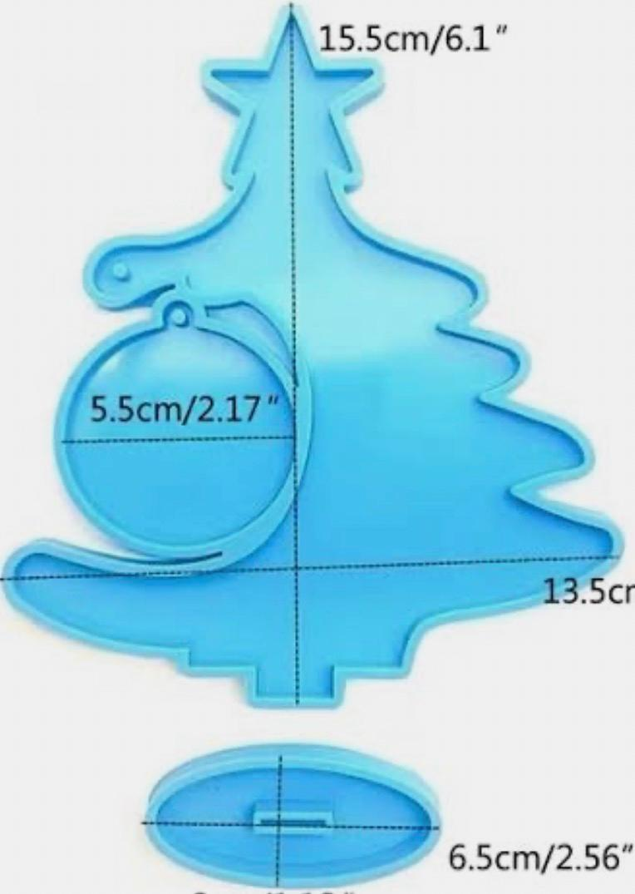

# SEMANA 8 TAREA DISEÑO DE MOLDE

Para esta tarea realicé un diseño para cortar en espuma rosa utilizando el router CNC. Como primer paso, seleccioné una imagen de inspiración, la cual me ayudó a definir la forma general y los elementos principales del modelo.

A partir de esta referencia, enocntré una imagen con medidas y las aproximé a las que yo quería, asegurándome de considerar las dimensiones reales del material y las limitaciones de la máquina.

Posteriormente diseñé la pieza en SolidWorks, ajustando cada detalle para que el corte fuera preciso.

  

<!-- Botón de descarga -->

  

  

<!-- Botón de descarga -->

  

