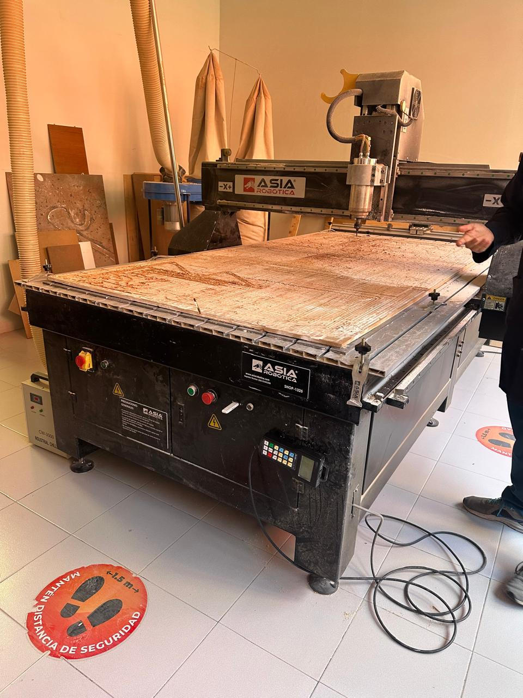
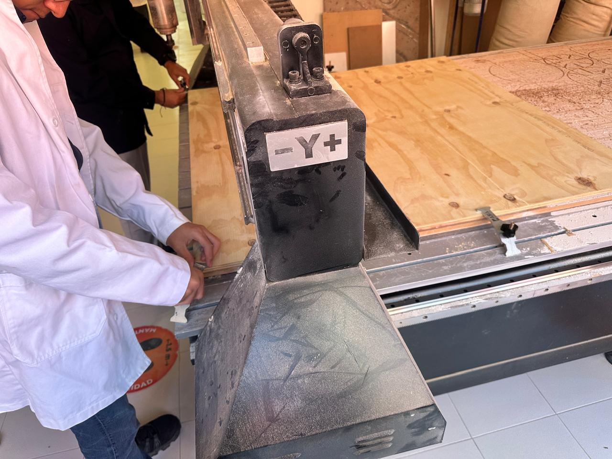
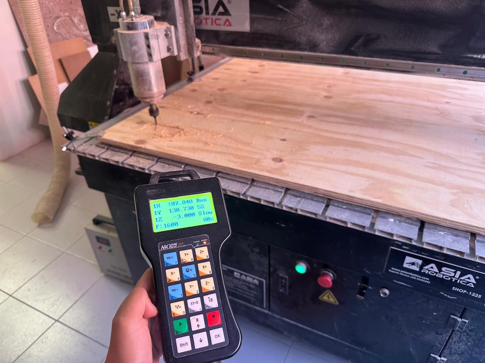
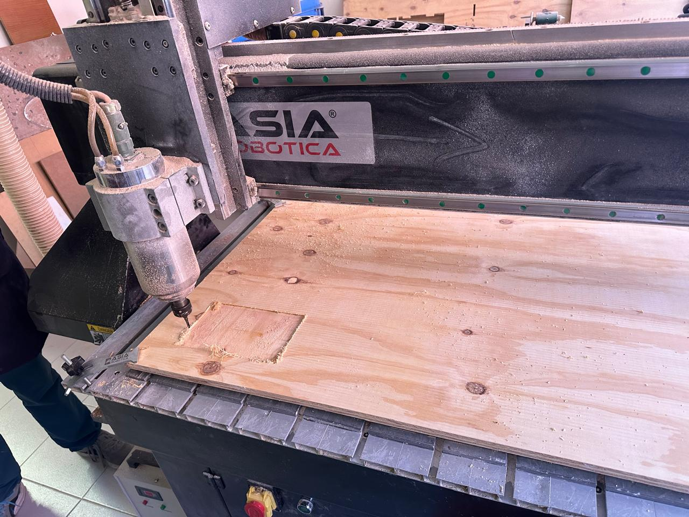
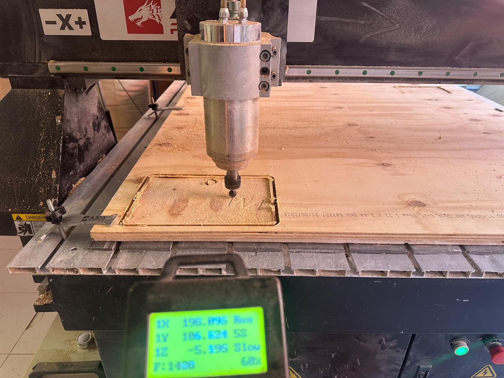
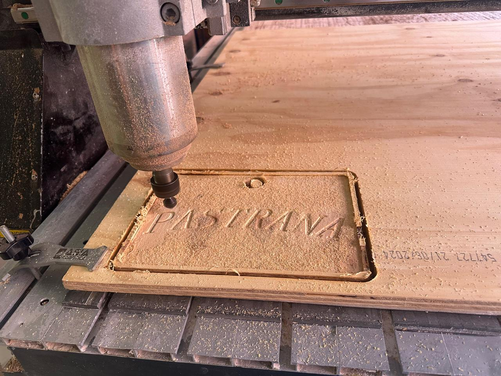
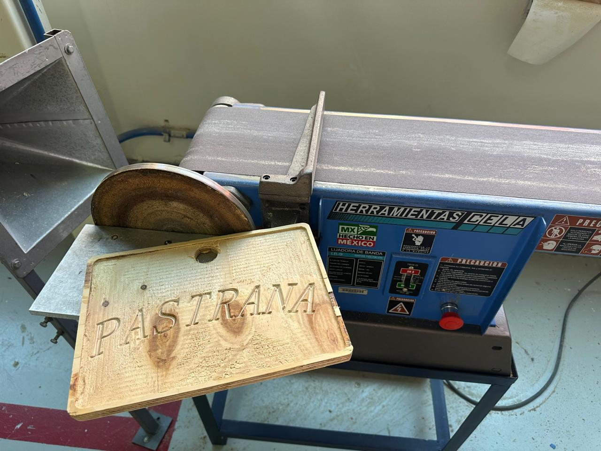

# SEMANA 9 TAREA TABLA FINALIZADA

Después de haber generado los códigos de corte durante la clase, la tarea consistió en ir a cortar la tabla en el router CNC. Primero coloqué la madera sobre la mesa de la máquina y la fijé firmemente con los soportes para evitar cualquier movimiento. 

  
  

Una vez asegurado el material, encendí el router y procedí a configurar los ejes X, Y y Z, estableciendo correctamente el punto de origen. Antes de iniciar el corte, conecté mi memoria USB y abrí el archivo correspondiente directamente desde la interfaz del router. Luego posicioné la punta de la herramienta justo arriba del punto de origen inicial y comencé el proceso. Al inicio puse la máquina a baja velocidad para verificar que la trayectoria fuera correcta y asegurarme de que no hubiera errores. Después aumenté la velocidad para evitar que la punta se calentara y se dañara.

  

Cada vez que terminaba un proceso, limpiaba la superficie con la aspiradora industrial, retiraba el polvo y revisaba que el material estuviera en buenas condiciones antes de continuar. Luego cargaba el siguiente archivo, configuraba nuevamente el eje Z según la punta instalada y repetía el procedimiento.

  
  
  

Al finalizar todos los cortes, retiré mis piezas terminadas junto con el material sobrante, dejé limpia el área de trabajo y apagué las máquinas.

  

